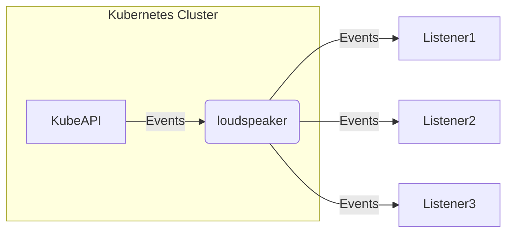

# 📢 Loudspeaker Operator

[](https://hub.docker.com/repository/docker/masanetes/loudspeaker)
[](https://pkg.go.dev/github.com/masanetes/loudspeaker)
[](https://github.com/masanetes/loudspeaker/actions/workflows/test.yaml)
[](https://goreportcard.com/report/github.com/masanetes/loudspeaker)
[](https://codecov.io/gh/masanetes/loudspeaker)

Loudspeaker retrieves Events from KubeAPI and sends them to the pre-registered Listeners.



## Install

```
kubectl apply -f https://raw.githubusercontent.com/masanetes/loudspeaker/master/install/install.yaml
```

## Supported listeners

- Sentry

## Preparation of runtime setting

```
cat <<EOF | kubectl apply -f -
apiVersion: v1
kind: ServiceAccount
metadata:
  name: loudspeaker-runtime
  namespace: default
---
apiVersion: rbac.authorization.k8s.io/v1
kind: ClusterRoleBinding
metadata:
  name: loudspeaker-runtime
roleRef:
  apiGroup: rbac.authorization.k8s.io
  kind: ClusterRole
  name: view
subjects:
  - kind: ServiceAccount
    name: loudspeaker-runtime
    namespace: default
EOF
```

## Preparation of confidential listener information
```
cat <<EOF | kubectl apply -f -
apiVersion: v1
kind: Secret
metadata:
  name: sentry-secrets
type: Opaque
stringData:
  credentilas.yaml: |
    dsn: "sample"
EOF
```

## Sample custom resource

https://github.com/masanetes/loudspeaker/blob/master/config/samples/loudspeaker_v1alpha1_loudspeaker.yaml

```yaml
apiVersion: loudspeaker.masanetes.github.io/v1alpha1
kind: Loudspeaker
metadata:
  name: loudspeaker-sample
spec:
  image: masanetes/loudspeaker-runtime:latest
  serviceAccountName: loudspeaker-runtime  
  listeners:
    - name: foo
      type: sentry
      credentials: sentry-secrets
      subscribes:
        - namespace: "" # all namespaces
          ignore: ["BackoffLimitExceeded"]
        - namespace: "default"
          ignore: ["Unhealthy"]
    
    - name: bar
      type: sentry
      credentials: sentry-secrets
      subscribes:
        - namespace: "" # all namespaces
          ignore: ["BackoffLimitExceeded"]
        - namespace: "default"
          ignore: ["Unhealthy"]
    
    - name: baz
      type: sentry
      credentials: sentry-secrets
      subscribes:
        - namespace: "" # all namespaces
          ignore: ["BackoffLimitExceeded"]
        - namespace: "default"
          ignore: ["Unhealthy"]
```
