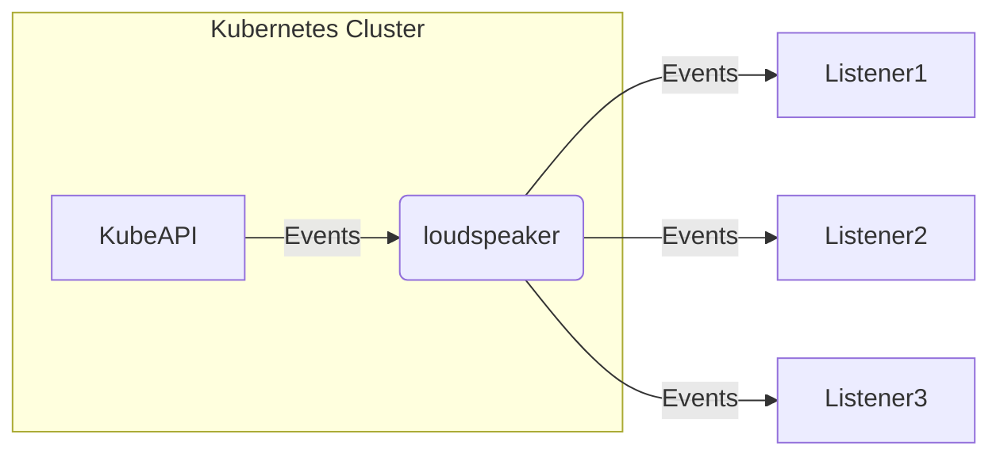

# Loudspeaker

[](https://github.com/masanetes/loudspeaker/actions/workflows/test.yml)
[](https://goreportcard.com/report/github.com/masanetes/loudspeaker)
[](https://codecov.io/gh/masanetes/loudspeaker)

Loudspeaker retrieves Events from KubeAPI and sends them to the pre-registered Listeners.



## Supported providers

- Sentry

## Apply Credentials

```bash
$ echo -n 'https://xxxxxxxxxxxxxxxxxxxxxxxxxxxxxxxx@xxx.xxx.xxx.xxx' > ./dsn.txt
$ kubectl create secret generic sentry-secrets --from-file=dsn=./dsn.txt
```

or

```
cat <<EOF | kubectl apply -f -
apiVersion: v1
kind: Secret
metadata:
  name: sentry-secrets
data:
  dsn: <base64 dsn>
EOF
```

## Sample custom resource

https://github.com/masanetes/loudspeaker/blob/master/config/samples/loudspeaker_v1_loudspeaker.yaml

```yaml
apiVersion: loudspeaker.masanetes.github.io/v1
kind: Loudspeaker
metadata:
  name: loudspeaker-sample
spec:
  image: "loudspeaker-runtime:latest"
  listeners:
    - type: "sentry"
      credentials: "sentry-secrets"
      subscribes:
        - namespace: "default"
          ignore: ["BackoffLimitExceeded"]
        - namespace: "sample"
          ignore: ["Unhealthy"]
```
