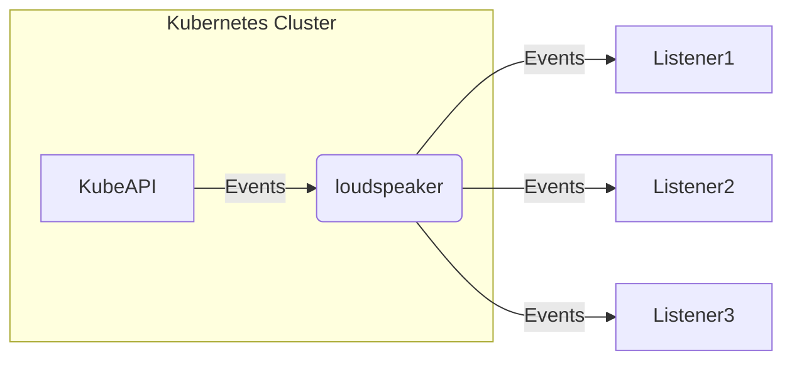

# Loudspeaker

Loudspeaker retrieves Events from KubeAPI and sends them to the pre-registered Listeners.

## Supports Lister

- Sentry

## Sample CRDs

https://github.com/masanetes/loudspeaker/blob/master/config/samples/loudspeaker_v1_loudspeaker.yaml
