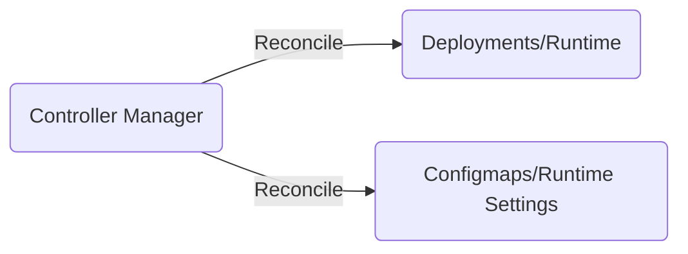

# Loudspeaker Operator

[](https://opensource.org/licenses/MIT)
[](https://hub.docker.com/repository/docker/ureuzy/loudspeaker)
[](https://pkg.go.dev/github.com/ureuzy/loudspeaker)
[](https://github.com/ureuzy/loudspeaker/actions/workflows/test.yaml)
[](https://goreportcard.com/report/github.com/ureuzy/loudspeaker)
[](https://codecov.io/gh/ureuzy/loudspeaker)

Loudspeaker uses the operator pattern to manage the runtime that delivers events from KubeAPI to listeners.

It can be configured which namespace events to observe, which events to discard, etc.
These settings are managed by configmap, and the runtime can change its observation target in real time by overwriting its own settings when it detects a configuration change.

[See runtime doc for details](https://github.com/ureuzy/loudspeaker-runtime)




# 🚀 Quick Start

## Install Loudspeaker Operator

```
$ kubectl apply -f https://raw.githubusercontent.com/ureuzy/loudspeaker/master/install.yaml
```

> Note: cert-manager is required as a certificate for webhook. If you do not have it, please refer to the link to install it.
> https://cert-manager.io/


## Preparation of runtime setting

Create serviceaccount and clusterrolebindings for runtime to observe events. 
This serviceaccount is associated with the serviceaccountname of the Pod by the operator.

```
cat <<EOF | kubectl apply -f -
apiVersion: v1
kind: ServiceAccount
metadata:
  name: loudspeaker-runtime
  namespace: default
---
apiVersion: rbac.authorization.k8s.io/v1
kind: ClusterRoleBinding
metadata:
  name: loudspeaker-runtime
roleRef:
  apiGroup: rbac.authorization.k8s.io
  kind: ClusterRole
  name: view
subjects:
  - kind: ServiceAccount
    name: loudspeaker-runtime
    namespace: default
EOF
```

## Preparation of confidential listener information

Confidential information is needed to post the event to the destination, so it is managed in secrets. CRD also needs to set a type for each listener, since the format of the setting varies depending on the destination.

```
cat <<EOF | kubectl apply -f -
apiVersion: v1
kind: Secret
metadata:
  name: sentry-secrets
type: Opaque
stringData:
  credentials.yaml: |
    dsn: "sample"
EOF
```

## Sample custom resource

https://github.com/ureuzy/loudspeaker/blob/master/config/samples/loudspeaker_v1alpha1_loudspeaker.yaml

```yaml
apiVersion: loudspeaker.ureuzy.github.io/v1alpha1
kind: Loudspeaker
metadata:
  name: loudspeaker-sample
  namespace: default  
spec:
  serviceAccountName: loudspeaker-runtime  
  listeners:
    - name: foo
      type: sentry
      credentials: sentry-secrets
      observes:
        - namespace: "" # all namespaces
          ignoreReasons: ["ScalingReplicaSet"]
          ignoreObjectNames: ["sample-deploy"]
          ignoreObjectKinds: ["Deployment"]
          ignoreEventTypes: ["Normal"]
    
    - name: bar
      type: sentry
      credentials: sentry-secrets
      observes:
        - namespace: "default"
          ignoreReasons: [""]
          ignoreObjectNames: ["sample-cronjob"]
          ignoreObjectKinds: ["Cronjob"]
          ignoreEventTypes: ["Warning"]
```
